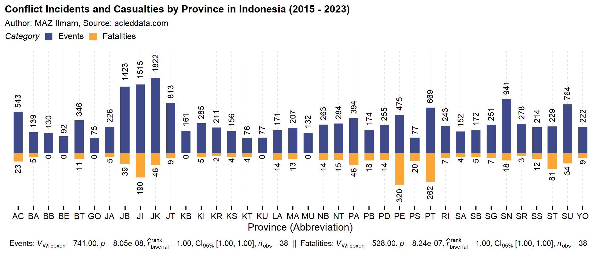

# Analisis Eksploratif Konflik di Indonesia (2015-2023): Kajian Data ACLED

MAZ Ilmam

Repositori ini berisi sumber R Markdown untuk mempersiapkan laporan penelitian "Analisis Eksploratif Konflik di Indonesia (2015-2023): Kajian Data ACLED" atau artikel ilmiah yang bersumber dari laporan tersebut yang akan diterbitkan di jurnal ilmiah yang relevan setelah proyek ini dinyatakan selesai (_saat ini proyek masih berlangsung_). Paket tambahan untuk keperluan proyek ini adalah [themezata](https://github.com/zata18/themezata).

Proyek ini bertujuan untuk menganalisis data konflik yang terjadi di Indonesia dari 1 Januari 2015 hingga setidaknya 31 Desember 2023 menggunakan data dari Armed Conflict Location & Event Data Project (ACLED). Analisis ini bertujuan untuk mengeksplorasi pola, tren, dan karakteristik konflik yang terjadi di Indonesia selama periode waktu tersebut. Proyek ini akan dilakukan dengan menggunakan bahasa pemrograman R. 

Analisis data konflik ACLED untuk Indonesia memiliki beberapa langkah utama:
  
1. **Pemrosesan Data**: Data ACLED akan diimpor dan dimuat ke dalam lingkungan R untuk diproses dan dipersiapkan sebelum analisis dimulai.
2. **Eksplorasi Data**: Data akan dieksplorasi untuk memahami distribusi spasial dan temporal dari konflik, termasuk jumlah kejadian, jenis konflik, lokasi, dan lainnya.
3. **Analisis Statistik**: Berbagai teknik analisis statistik akan diterapkan untuk mengidentifikasi pola, tren, dan faktor-faktor yang berkaitan dengan konflik di Indonesia.
4. **Visualisasi**: Hasil analisis akan divisualisasikan dalam bentuk grafik, peta, dan visualisasi lainnya untuk membantu memahami dan mengkomunikasikan temuan-temuan.

Anda dapat berkontribusi pada proyek ini dengan cara melaporkan bug, ketidakakuratan atau masalah lain, memberikan saran atau perbaikan untuk kode atau analisis, dan mengirimkan permintaan tarik. Jika Anda melakukan yang terakhir, dalam pesan komit Anda, harap tambahkan kalimat "Saya memberikan hak cipta kontribusi ini kepada MAZ Ilmam".

## Lisensi

Karya ini dilisensikan di bawah Lisensi [Atribusi-NonKomersial-TanpaTurunan 4.0 Internasional](https://creativecommons.org/licenses/by-nc-nd/4.0/legalcode.id).

## Kemungkinan Pertanyaan yang Muncul

**1. Mengapa Anda tidak menampilkan/menyertakan kode skrip?**
Kode skrip belum ditampilkan karena masih dalam proses penyusunan, perbaikan, dan pengembangan. 

**2. Apakah Anda akan menyertakan kode skrip? Kapan?**
Ya, saya akan menyertakan kode skrip begitu proses penyusunan, perbaikan, dan pengembangan selesai dan kode tersebut telah siap untuk dibagikan. Saya berkomitmen untuk memberikan kode yang berkualitas dan dapat dipercaya, dan akan memastikan untuk menyertakan kode tersebut pada saat yang tepat.

## Disclaimer

Ini adalah repositori pribadi yang saat ini tidak dimaksudkan untuk penggunaan publik. Repositori ini berfungsi sebagai tempat penyimpanan sumber R Markdown untuk laporan penelitian. Repositori ini disediakan "sebagaimana adanya", tanpa jaminan jenis apapun, eksplisit atau tersirat, termasuk namun tidak terbatas pada jaminan keberhasilan, kesesuaian untuk tujuan tertentu, dan tidak ada jaminan atau tanggung jawab yang diberikan terhadap kemungkinan bahwa penggunaan repositori ini melanggar hukum atau peraturan tertentu. Tidak akan ada pemasangan atau dukungan teknis yang disediakan oleh penyedia repositori.

## Kontak

Jika Anda memiliki pertanyaan atau saran, jangan ragu untuk menghubungi saya melalui surel di [inizata@gmail.com](mailto:inizata@gmail.com).
