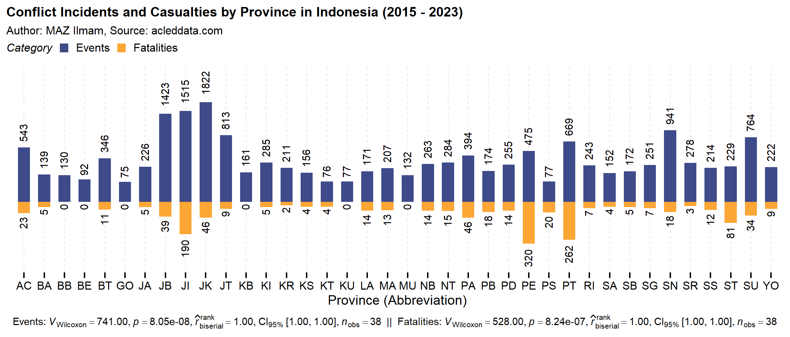

# Analisis Eksploratif Konflik di Indonesia (2015-2023): Kajian Data ACLED

**MAZ Ilmam**
  

Repositori ini berfungsi sebagai tempat penyimpanan sementara untuk sumber R Markdown dalam rangka penyusunan laporan penelitian "Analisis Eksploratif Konflik di Indonesia (2015-2023): Kajian Data ACLED". Tujuan utama proyek ini adalah menganalisis data konflik yang terjadi di Indonesia dari 1 Januari 2015 hingga setidaknya 31 Desember 2023**  menggunakan data dari Armed Conflict Location & Event Data Project (ACLED), mengeksplorasi pola, tren, dan karakteristik konflik yang terjadi di Indonesia selama periode waktu tersebut. Proyek ini akan dilakukan dengan menggunakan bahasa pemrograman R. Dataset saat ini memiliki 14.658 baris dan 31 kolom data (per 1 Januari 2015 - 31 Desember 2023).

** Kemungkinan besar akan berlanjut untuk menggunakan data hingga Desember 2024.

## Langkah Analisis Data

1. **Pemrosesan Data**: Data ACLED akan diimpor dan dimuat ke dalam lingkungan R untuk diproses dan dipersiapkan sebelum analisis dimulai.

2. **Eksplorasi Data**: Data akan dieksplorasi untuk memahami distribusi spasial dan temporal dari konflik, termasuk jumlah kejadian, jenis konflik, lokasi, dan lainnya.

3. **Analisis Statistik**: Berbagai teknik analisis statistik akan diterapkan untuk mengidentifikasi pola, tren, dan faktor-faktor yang berkaitan dengan konflik di Indonesia.

4. **Visualisasi**: Hasil analisis akan divisualisasikan dalam bentuk grafik, peta, dan visualisasi lainnya untuk membantu memahami dan mengkomunikasikan temuan-temuan.

## Informasi Tambahan

Jika Anda memiliki pertanyaan atau saran, jangan ragu untuk menghubungi saya melalui surel di [inizata@gmail.com](mailto:inizata@gmail.com).

## Disclaimer
  
Repositori ini adalah tempat penyimpanan pribadi dan tidak dimaksudkan untuk penggunaan publik atau menerima kontribusi eksternal. Repositori ini berfungsi sebagai penyimpanan sementara untuk sumber R Markdown yang digunakan dalam penyusunan laporan penelitian yang sedang berlangsung.

Harap dicatat bahwa tidak ada jaminan atau tanggung jawab yang diberikan oleh pemilik repositori terhadap kemungkinan penggunaan repositori ini untuk tujuan selain pengembangan pribadi. Tidak akan ada dukungan teknis atau bantuan yang disediakan oleh pemilik repositori. Repositori ini disediakan "sebagaimana adanya," tanpa jaminan jenis apapun, eksplisit atau tersirat, termasuk namun tidak terbatas pada jaminan keberhasilan, kesesuaian untuk tujuan tertentu. Pemilik repositori tidak bertanggung jawab atas kemungkinan bahwa penggunaan kode atau data di dalamnya melanggar hukum atau peraturan tertentu.
